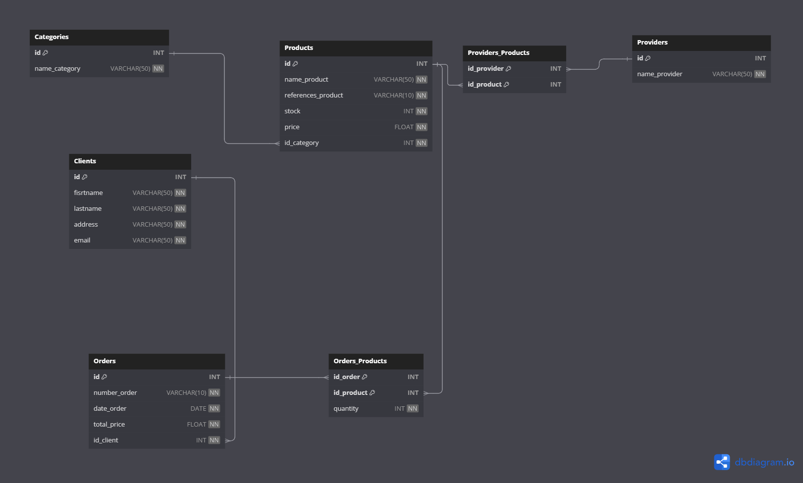

# exam_EBDD



## Installation et lancement du serveur

Pour initialiser la base de données :
- Commencer par créer un fichier .env à partir du .env.example

```
DB_HOST=localhost
DB_USERNAME=username
DB_PASSWORD=password
DB_DATABASE=Aeromodel
DB_PORT=port
```
- Ensuite, lancer cette commande afin qu'elle soit initialisée.
```bash
npm run start:db
```

- Vous pouvez ensuite installer les dépendances et lancer le serveur.

```bash
npm i 
npm run dev
```
- Le serveur est maintenant accessible via [Api](http://localhost:3001/)

## Failles de sécurité
- Dans les routes PUT, POST et DELETE, il y a un risque d'injection SQL, c'est à dire que du code en langage SQL peut être envoyer afin d'altérer la base de donnée. Cela est dû au fait qu'un utilisateur puisse envoyer des données pour insérer, modifier, supprimer des informations mais qu'elles ne sont pas filtrés. Un utilisateur mal intentionné peut jouer de cette faille pour, par exemple, supprimer la base de données.

- Pas d'authentification : Actuellement, l'api n'a pas de systèmes d'authentification. Toutes les routes sont accessibles librement par n'importe qui. Une personne extérieure à l'entreprise peut donc influer sur la gestion de stock de nos produits pour peu qu'il connaisse l'URL de notre API. Il peut, par exemple créer une commande à son nom ou changer le prix des produits.

- Actuellement, la décrémentation automatique du stock des produits n'est pas prise en charge. On peut par exemple commander plus de produits qu'il y en a en stock. 

- A cause du manque de vérifications des données, on peut avoir des champs vides ou des valeurs incorrectes. Par exemple, un utilisateur sans nom, un produit avec un prix à 0 ou négatif ou bien, ou bien même une commande sans produit.

- Les champs par lesquelles sont filtrés les requêtes ne sont pas unique. Par exemple, lors de la suppression d'un client, je le fais via son email. Or, n'étant pas un champ unique, tous les clients portant cet email seront supprimés. 

##  Solutions possibles  
- Mise en place de requêtes préparées : Les valeurs externes insérées dans la requête ne sont pas considérés comme du SQL mais comme des valeurs. Cela permet d'éviter que lorsqu'un attaquant envoie du code SQL, cela soit interprété comme telle.

- Clé d'api : Mettre en place une clé d'api qui permettra d'identifier les utilisateurs qui se connecte à l'API.

- Amélioration de la logique métier : Ajout de la décrementation automatique du stock lors de la création d'une commande.

- Contrôle de la cohérence des valeurs envoyés, c'est-à-dire que les champs ne soit pas vide ou pas du bon type. Utilisation de middleware pour vérifier chaque entrée utilisateur.

- Rendre  unique les colonnes que j'utilise lors des conditions pour retrouvés une ligne ou pour la supprimer.
